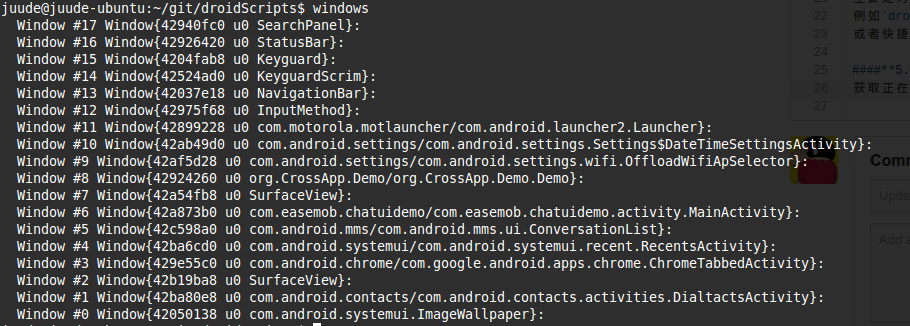

Android开发脚本
=======

#### 1. app.py
**实现功能**

1. `app.py clear [packagename]` :清空app数据
2. `app.py details [packagename]` 跳转到app详情页面
3. `app.py dump [packagename]` 输出dump信息
4. `app.py list`[key] 查找安装的app
5. `app.py uninstall [packagename]`: 卸载app

#### 2.mock.py
一个调试工具包,可以模拟程序运行的信息,或者在运行时候改变变量值，方便调试。
使用前必须安装客户端,详细情况可以看这里的[文档](https://raw.githubusercontent.com/Juude/droidMock/master/README.md)

#### 3.pidcat.py
可以通过进程名字获取log 代码源地址：https://github.com/JakeWharton/pidcat/

#### 4.droid.py
主要是对`adb shell input keyevent`按键的封装
例如`droid.py input KEYCODE_POWER`可以模拟电源键
或者快捷点的访问方式`droid.py screen`也可以。对于一直敲代码不想离开键盘的同学还是很有用的。

#### 5.window
获取正在运行的window list

#### 6.mem.py
获取指定应用占用的内存
